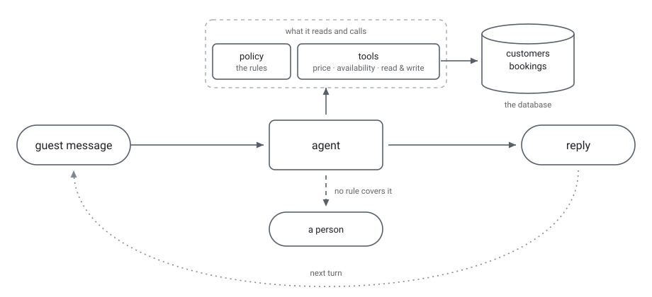

# restaurant-reservation-agent

Reservations arrive by WhatsApp, by email and by phone. This agent reads the
venue's rules and its bookings database, then answers on its own, at any hour.

Five actions: **book, modify, cancel, inform, escalate to a human.**

**Scope.** A prototype. Venue X, its rules and all the data here are fictional.

---

## What it does



On every message the agent reads the venue's rules and calls its tools for a
price, for a free table, to look up a guest or to save a booking. It informs,
books, changes and cancels. When only a person can decide, it hands over and
stops.

---

## Demo

<!-- TODO (phase 7): Hugging Face Space link + a short gif of a real conversation -->

*Coming in phase 7: a live Space and a recorded conversation.*

---

## How it works

Six layers, each with one job. The point of the split is that the language
model only handles language and it never computes a figure and never decides
whether a table is free.

| layer | its job | where it lives |
|---|---|---|
| instructions | who the agent is, how it speaks, when it stops | `prompts/` |
| policy as data | the venue's rules, as JSON the code reads | `config/policy.json` |
| deterministic tools | money, availability, reading and writing bookings | `tools.py` |
| guardrails | check the request before acting, check the reply before sending | `engine.py` |
| human handoff | the agent decides a person is needed, passes everything it knows, then goes quiet | `config/policy.md` §13 |
| evaluation | 58 policy cases, 11 dialogues, 10 metrics | `evals/` |

Swapping in another restaurant means editing `config/`. Nothing else.

A guest cannot ask for a human. The agent escalates only when a rule in §13
says only a person can answer, and once it has handed over the code stops it
replying at all.

---

## Contents

| where | what |
|---|---|
| `config/` | the venue: rules for people, the same rules as JSON, inventory, FAQ |
| `db/` | schema and seeded fake data, built to hit the hard cases |
| `prompts/` | who the agent is, and four worked examples |
| `tools.py` | the eight deterministic functions for money, availability, bookings |
| `engine.py` | the prompt, the tool loop, conversation state, the runner |
| `evals/` | 58 policy cases, 11 hand-written dialogues, and the scoring script |
| `runs/` | five saved runs, and the report they were scored into |
| `tests/` | checks the dialogue files and the schema stay valid |

---

## Evaluation

5 of 11 dialogues pass every run and it never escalates when it should not.
DLG-07, 08 and 11 fail every run, DLG-10 nearly always, and DLG-04 and 06
fail sometimes.

### What we measure

Four axes. Each asks a different question about the same conversation.

| axis | the question | metrics |
|---|---|---|
| **Understanding** | did it understand what the guest asked for? | intent accuracy, slot accuracy (JGA) |
| **Decision** | did it pick the right move? | action accuracy, over-escalation, under-escalation |
| **Execution** | did it do the right thing? | tool accuracy, money accuracy, booking accuracy |
| **Efficiency** | what does it cost to run? | cost per dialogue, latency per turn |

An agent can pass one axis and fail another. It can understand the request
perfectly and still quote the wrong deposit. That is why they are separate.

Reply wording is deliberately **not** scored. What matters is the figure and
the decision, not the phrasing.

**The four things being compared**

- **intent:** what the guest wants in this message: `book`, `modify`,
  `cancel`, `inform`, `bye`.
- **slots:** the seven fields of the request: name, party size, date, start
  time, product, phone, email. JGA means all seven must be right at once.
- **action:** what the agent did: `book`, `modify`, `cancel`, `inform`,
  `escalate`, `none`.
- **tools:** which of the eight functions in `tools.py` it called. The model
  never does arithmetic; the tools do.

### The ten metrics

| # | metric | axis | counted per | score |
|---|---|---|---|---|
| 1 | intent accuracy | Understanding | turn (goodbyes excluded) | 44/58 [42/58 - 48/58] |
| 2 | slot accuracy (JGA) | Understanding | turn, all 7 slots exact | 61/67 [50/67 - 62/67] |
| 3 | action accuracy | Decision | turn (`none` excluded) | 43/54 [41/54 - 45/54] |
| 4 | over-escalation | Decision | turn where no escalation was needed | 0 [0 - 0] of 8 |
| 5 | under-escalation | Decision | turn where escalation was needed | 1 [0 - 1] of 5 |
| 6 | tool accuracy | Execution | turn | 43/67 [42/67 - 47/67] |
| 7 | money accuracy | Execution | fact key | 51/66 [45/66 - 57/66] |
| 8 | booking accuracy | Execution | fact key | 89/110 [89/110 - 90/110] |
| 9 | cost per dialogue | Efficiency | dialogue | ~$0.046 per conversation; $0.5077 [$0.4954 - $0.5682] for all 11 |
| 10 | latency per turn | Efficiency | turn, median and p95 | median 4.787s [4.496 - 4.979], p95 8.255s [7.529 - 8.908] |

- DLG-01: passed 5 of 5
- DLG-02: passed 5 of 5
- DLG-03: passed 5 of 5
- DLG-04: passed 3 of 5
- DLG-05: passed 5 of 5
- DLG-06: passed 4 of 5
- DLG-07: passed 0 of 5
- DLG-08: passed 0 of 5
- DLG-09: passed 5 of 5
- DLG-10: passed 1 of 5
- DLG-11: passed 0 of 5

### Why each one failed

DLG-04 failed 2 of 5 - turn 9: minimum_spend_pp 0, got 250
DLG-06 failed 1 of 5 - turn 3: booking_status 'confirmed', got 'cancelled'
DLG-07 failed 5 of 5 - turn 3: booking_created True, got False
DLG-08 failed 5 of 5 - turn 3: reply_language 'nl', got 'en'
DLG-10 failed 4 of 5 - turn 3: escalated True, got False
DLG-11 failed 5 of 5 - turn 5: payment_link_sent True, got False

### How these numbers were produced

The eleven dialogues follow the shape of MultiWOZ 2.2. User turns carry a belief
state, system turns carry an action. They are written by hand and kept unseen
by the model, so they stay a test set.

The model does not answer the same way twice. One run is luck, not a result.

So all eleven dialogues are run **five times**, and each run is saved whole —
every turn, expected against got — under `runs/run-01/` … `runs/run-05/`.
A separate script, `evals/score.py`, reads those saved files and computes the
table above. **It never calls the model**, so re-scoring is free and the
numbers can always be traced back to a saved turn.

Each metric is reported as a **median across the five runs, with the lowest
and highest in brackets**. Not an average: with five runs an average hides
whether a number is stable or swinging.

Each dialogue is reported as **passed N of 5**, with the reason it failed.
"DLG-06 passed 1 of 5" is a true sentence. "DLG-06 passed" is not.

The full report, including cost and latency per dialogue and every phrase
check, is in [`runs/report.md`](runs/report.md).

### What these numbers do not say

- Tool ground truth is derived from the dialogues by a model, not written by
  hand. It is the least trustworthy of the ten.
- Escalation rests on 8 turns where it should not escalate and 5 where it
  should. Read those as fractions, not percentages.
- The silence after a handover is enforced by `engine.py`, not chosen by the
  agent. With the guard removed, the model would have replied on 5 of 6 of
  those turns.
- Latency measures the model plus a home connection, not a deployment.
- Known gaps in the agent itself: dlg-11 turn 9 has a cross-booking fact gap,
  the `both` product is untested, and the deposit is derived rather than
  stored.

---

## Run it

Needs an `ANTHROPIC_API_KEY` in the environment (or a `.env` file) to call
the model - seeding the DB and reading dialogue files do not.

```bash
# set up a virtual environment
python -m venv .venv
source .venv/bin/activate        # Windows: .venv\Scripts\activate

# install
pip install -r requirements.txt
echo "ANTHROPIC_API_KEY=sk-ant-..." > .env

# seed the DB
python db/seed.py

# run one dialogue against the model
python engine.py evals/dialogues/dlg-01-party-size-change.json

# run all eleven dialogues, saved under runs/<label>/
python engine.py all run-01

# turn saved runs into the numbers above; never calls the model
python evals/score.py
```

---

## Status

Phase 6 of 8. Setup, policy, data, dialogues, architecture, engine and
evaluation are done. Next: a web UI on Hugging Face Spaces, then email,
WhatsApp and voice.

**Stack:** Python 3.11, SQLite, JSON, Anthropic API

---

## What comes next

Ideas beyond the above, roughly in the order they would pay off.

- **Every escalation is a missing rule.** When the agent hands over, it has hit
  a question the policy does not answer and `runs/escalations.jsonl` records
  each one with its reason. That log is a to-do list: write the answer into
  `config/policy.md` or `config/faq.md`, add a dialogue that tests it, and the
  agent handles that case by itself from then on. The escalation rate should
  fall with every round.
- **Let the guest ask for a person.** Today only the agent decides, which keeps
  the escalation metrics honest and stops a guest getting past a refusal by
  asking for a manager. A real venue still needs the option with a limit, so
  it cannot be used to reopen a rule the agent has already applied.
- **More languages.** Today it refuses politely in a language it does not
  know. It should just reply in it.
- **Stricter moderation.** A public number gets rude messages, spam, and people
  trying to trick the agent. It should spot these and stop.  
- **Menu and allergens.** These questions go to a person today because no
  file can answer them. One menu file would fix that.
- **More situations.** Today it handles booking, changing, cancelling and a
  late arrival. No-shows, waitlists, large private events and birthdays are
  just as common and none are covered. Each one is a policy section, a tool
  and a dialogue.  
- **A real booking system.** The bookings live in SQLite here. A restaurant's
  own system would go behind the same tools.
- **Voice.** Same agent, speech in and speech out. The hard part is that a
  caller will not wait while a tool runs.
- **A stronger engine.** Several agents instead of one, a fine-tuned model,
  prompt tuning with DSPy. Keep whichever one raises the scores above.

None of these are isolated. Every dialogue or metric added exposes something
the current setup does not handle, and the fix is rarely in one place as it can
be a line in the prompt, a rule in the policy, a check before or after the
model, or a new tool. That is the loop: add a case, run it, see what breaks,
fix the layer that owns it, run everything again.

---

## License

MIT - see [LICENSE](LICENSE).
